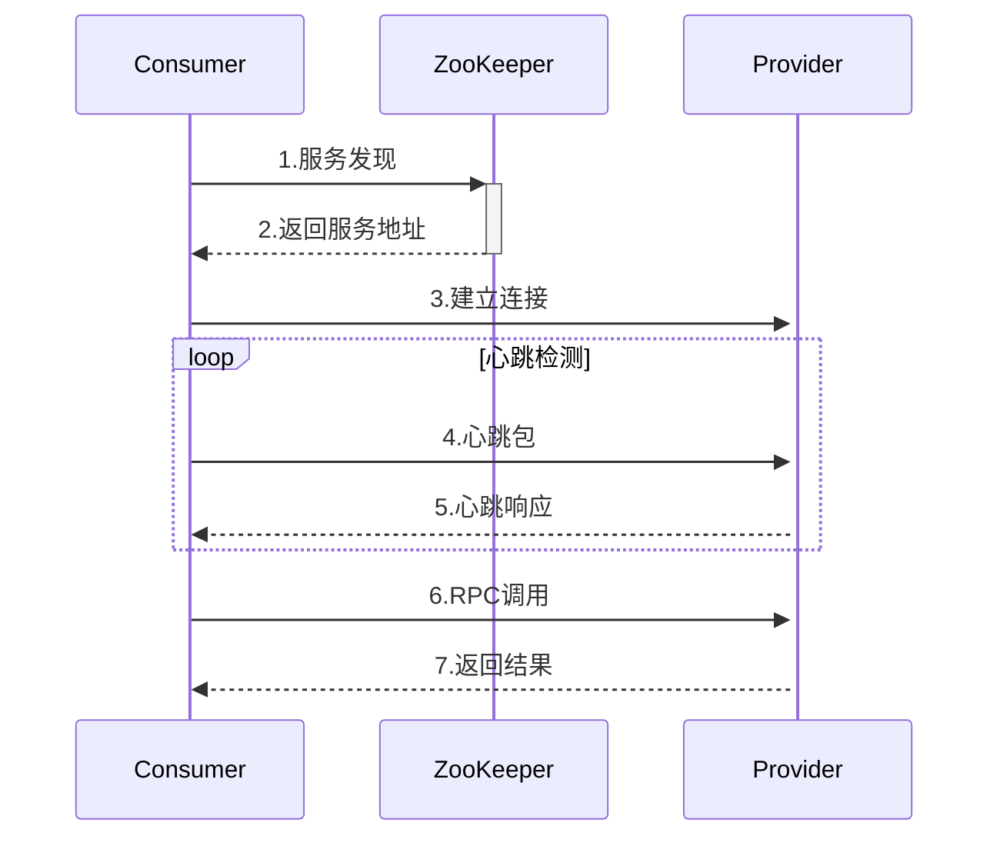

# Jianbing-RPC 

一个基于Netty和ZooKeeper实现的轻量级RPC框架，专为分布式系统通信设计。

## 📦 核心特性

- **高性能通信**：基于Netty的NIO模型实现
- **服务治理**：ZooKeeper注册中心支持
- **协议定制**：自定义二进制通信协议
- **心跳检测**：支持服务健康监测
- **异步调用**：CompletableFuture实现请求响应模型

## 🛠️ 技术栈

| 组件      | 版本 | 用途             |
| --------- | ---- | ---------------- |
| Netty     | 4.x  | 网络通信框架     |
| ZooKeeper | 3.7+ | 服务注册与发现   |
| JDK       |  17  | 动态代理/NIO支持 |


## 🔍 核心设计

### 协议格式

```
 0               1               2               3               4          
+---------------+---------------+---------------+---------------+
|  Magic(12B)   | Version(1B)   | Header Len(2B)| Full Len(4B)  | --> Header
+---------------+---------------+---------------+---------------+
| ReqType(1B)   | Serialize(1B) | Compress(1B)  | RequestId(8B) | --> Meta
+---------------+---------------+---------------+---------------+
|                                  Body                         | --> Payload
+---------------------------------------------------------------+
```

- **Magic Number**: `Jianbing-RPC` 标识协议
- **Header Length**: 固定30字节
- **Request Types**:
  - `0x01` 普通请求
  - `0x02` 心跳检测

### 通信流程




## 🔧 配置参数

| 参数               | 默认值         | 说明         |
| :----------------- | :------------- | :----------- |
| zookeeper.address  | 127.0.0.1:2181 | 注册中心地址 |
| netty.port         | 8088           | 服务端口     |
| rpc.timeout        | 10s            | 调用超时时间 |
| heartbeat.interval | 30s            | 心跳检测间隔 |

## 🚧 未来优化

- 增加熔断降级机制
- 整合进Spring boot


